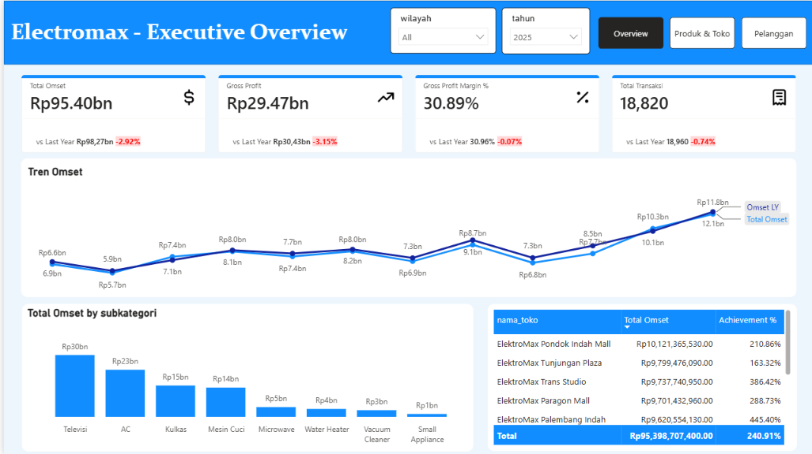

# Electromax — Analisis Kinerja Penjualan Eksekutif

## Ringkasan

Analisis ini mengevaluasi kinerja penjualan Electromax menggunakan dashboard Power BI level eksekutif. Analisis berfokus pada **pendapatan (revenue), volume transaksi, profitabilitas, dan kontribusi kategori produk**, kemudian menerjemahkan temuan tersebut menjadi tindakan bisnis yang praktis.

Tujuannya bukan sekadar melaporkan kinerja, tetapi mengidentifikasi area mana yang perlu mendapat perhatian manajemen, dengan tetap menjaga kesimpulan agar sesuai dengan data yang tersedia.

---

## 1. Pendapatan Menurun secara Year over Year

### Temuan

Pada tahun 2025, Electromax menghasilkan total pendapatan sekitar **Rp95,40 miliar**, turun **2,92% dibandingkan tahun sebelumnya**.

Di sisi lain, total transaksi hanya turun **0,74%**, dari 18.960 menjadi 18.820 transaksi.

| KPI | 2025 | Tahun Sebelumnya | YoY |
|---|---:|---:|---:|
| Total Pendapatan | Rp95,40 M | Rp98,27 M | **-2,92%** |
| Total Transaksi | 18.820 | 18.960 | **-0,74%** |

### Analisis

Pendapatan menurun lebih signifikan dibandingkan volume transaksi.

Berdasarkan angka yang tersedia, **Average Transaction Value (ATV)** juga mengalami penurunan:

- 2025: sekitar **Rp5,07 juta/transaksi**
- Tahun sebelumnya: sekitar **Rp5,18 juta/transaksi**
- Perubahan: sekitar **-2,20%**

Ini menunjukkan bahwa penurunan pendapatan diiringi oleh berkurangnya nilai rata-rata yang dihasilkan dari setiap transaksi.

### Implikasi Bisnis

Tantangan saat ini bukan sekadar meningkatkan jumlah transaksi. Bisnis juga perlu meningkatkan **nilai yang dihasilkan dari setiap transaksi**.

### Rekomendasi Tindakan

Prioritaskan inisiatif yang dapat meningkatkan nilai transaksi, seperti:

- Upselling ke produk dengan nilai lebih tinggi.
- Bundling produk yang saling melengkapi.
- Cross-selling aksesori atau produk pendukung yang relevan.
- Merancang promosi berdasarkan nilai transaksi minimum, bukan diskon yang berlaku luas.

Tujuannya adalah meningkatkan pendapatan **tanpa hanya mengandalkan peningkatan volume transaksi**.

---

## 2. Gross Profit Menurun Seiring Pendapatan

### Temuan

Gross Profit pada 2025 mencapai sekitar **Rp29,47 miliar**, turun **3,15% YoY**.

| KPI | 2025 | Tahun Sebelumnya | YoY |
|---|---:|---:|---:|
| Gross Profit | Rp29,47 M | Rp30,43 M | **-3,15%** |

### Analisis

Gross Profit menurun sedikit lebih cepat dibandingkan total pendapatan.

Ini berarti penurunan kinerja penjualan juga tercermin pada jumlah absolut gross profit yang dihasilkan.

Namun, dashboard yang tersedia belum cukup untuk mengaitkan perubahan ini dengan penyebab spesifik seperti diskon, bauran produk (product mix), harga, atau biaya pengadaan. Oleh karena itu, analisis ini tidak mengasumsikan satu penyebab tunggal.

### Implikasi Bisnis

Pemulihan pendapatan tidak boleh dikejar dengan mengorbankan profitabilitas.

Strategi yang meningkatkan penjualan namun menurunkan margin secara signifikan dapat memperbaiki pendapatan, tetapi justru melemahkan kualitas hasil bisnis secara keseluruhan.

### Rekomendasi Tindakan

Manajemen perlu mengevaluasi pemulihan pendapatan bersamaan dengan kinerja gross profit.

Fokus yang direkomendasikan:

- Memantau kontribusi gross profit per kategori produk.
- Membandingkan pertumbuhan pendapatan dengan pertumbuhan gross profit.
- Mengevaluasi dampak aktivitas promosi terhadap profitabilitas.
- Memprioritaskan pertumbuhan penjualan yang tetap menjaga margin sehat.

---

## 3. Gross Profit Margin Relatif Stabil

### Temuan

Gross Profit Margin (GPM) pada 2025 sebesar **30,89%**, dibandingkan **30,96%** pada tahun sebelumnya.

Perubahannya hanya sekitar **-0,07 poin persentase**.

| KPI | 2025 | Tahun Sebelumnya | Perubahan |
|---|---:|---:|---:|
| GPM | 30,89% | 30,96% | **-0,07 pp** |

### Analisis

Meskipun pendapatan dan gross profit sama-sama menurun, gross profit margin tetap relatif stabil.

Ini menunjukkan bahwa bisnis mampu mempertahankan level margin kotor yang relatif serupa meski pendapatan menurun.

### Implikasi Bisnis

Prioritas saat ini seharusnya adalah **memulihkan pendapatan sambil menjaga kualitas margin**, bukan mengejar pertumbuhan pendapatan melalui diskon yang serampangan.

### Rekomendasi Tindakan

Gunakan GPM sebagai guardrail dalam merancang strategi penjualan dan promosi.

Pendekatan yang direkomendasikan:

> **Tingkatkan Pendapatan + Jaga GPM Tetap Sehat**

Program promosi karenanya perlu dievaluasi bukan hanya dari tambahan penjualan yang dihasilkan, tetapi juga dari dampaknya terhadap gross profit.

---

## 4. Pendapatan Terkonsentrasi pada Televisi dan AC

### Temuan

Televisi dan AC merupakan dua subkategori penyumbang pendapatan terbesar dalam dashboard.

- Televisi: sekitar **Rp30 miliar**
- AC: sekitar **Rp23 miliar**
- Gabungan: sekitar **Rp53 miliar**

Bersama-sama, kedua kategori ini menyumbang sekitar **55,6% dari total pendapatan**.

*(Lihat chart "Total Omset by subkategori" pada gambar dashboard di atas.)*

### Analisis

Televisi dan AC jelas merupakan kontributor dominan terhadap total pendapatan.

Hal ini menjadikan keduanya kategori yang strategis penting untuk menjaga kinerja penjualan secara keseluruhan.

Di sisi lain, kategori-kategori lainnya menyumbang porsi pendapatan yang cukup besar dan memberikan peluang pertumbuhan tambahan.

### Implikasi Bisnis

Bisnis perlu menjaga eksekusi yang kuat pada kategori pendapatan terbesarnya, sambil mengembangkan kontributor tambahan, alih-alih hanya bergantung pada penyumbang pendapatan yang ada saat ini.

### Rekomendasi Tindakan

#### Lindungi Kategori Inti

Untuk Televisi dan AC, tetap fokus pada:

- Ketersediaan produk.
- Harga yang kompetitif.
- Assortment produk dengan permintaan tinggi.
- Kampanye promosi yang tertarget.
- Peluang cross-selling dan bundling.

#### Kembangkan Kategori Sekunder

Pantau kategori seperti:

- Kulkas
- Mesin Cuci
- Microwave
- Water Heater
- Vacuum Cleaner
- Small Appliance

Tujuannya bukan mengurangi pentingnya Televisi dan AC, melainkan menciptakan sumber pertumbuhan pendapatan tambahan yang berkelanjutan.

---

# Rekomendasi Bisnis

Berdasarkan temuan di atas, prioritas yang direkomendasikan adalah:

## Prioritas 1 — Meningkatkan Nilai Transaksi

Pendapatan turun 2,92% sementara transaksi hanya turun 0,74%, dengan Average Transaction Value juga menurun sekitar 2,20%.

**Tindakan:**

> Perkuat strategi upselling, bundling, dan cross-selling untuk meningkatkan nilai per transaksi.

---

## Prioritas 2 — Memulihkan Pendapatan Tanpa Mengorbankan Margin

Gross Profit turun 3,15%, sementara GPM relatif stabil di 30,89%.

**Tindakan:**

> Kejar pemulihan pendapatan sambil menjadikan GPM sebagai batasan (constraint) profitabilitas utama.

---

## Prioritas 3 — Melindungi Penyumbang Pendapatan Inti

Televisi dan AC menyumbang sekitar 55,6% dari total pendapatan.

**Tindakan:**

> Jaga ketersediaan stok, harga, assortment, dan eksekusi promosi yang kuat untuk dua kategori terdepan tersebut.

---

## Prioritas 4 — Membangun Penyumbang Pendapatan Tambahan

Kategori produk lainnya merepresentasikan peluang untuk mengurangi ketergantungan pada sumber pendapatan dominan saat ini.

**Tindakan:**

> Identifikasi kategori sekunder dengan karakteristik pendapatan, pertumbuhan, dan margin yang menarik, lalu kembangkan melalui strategi komersial yang tertarget.

---

# Kesimpulan Eksekutif

Kinerja tahun 2025 menunjukkan **penurunan kinerja penjualan yang moderat, bukan penurunan kualitas margin yang signifikan**.

Sinyal utamanya adalah:

1. **Pendapatan turun 2,92% YoY.**
2. **Transaksi hanya turun 0,74%.**
3. **Average Transaction Value turun sekitar 2,20%.**
4. **Gross Profit turun 3,15%.**
5. **GPM relatif stabil di 30,89%.**
6. **Televisi dan AC menyumbang sekitar 55,6% dari total pendapatan.**

Arah bisnis yang direkomendasikan adalah:

> **Tingkatkan nilai transaksi, pulihkan pendapatan, lindungi margin kotor, dan perkuat portofolio produk di luar dua kategori dominan.**

---

# Batasan Analisis

Analisis ini dengan sengaja menghindari mengaitkan perubahan kinerja dengan penyebab spesifik yang tidak dapat diamati langsung dari dashboard saat ini.

Sebagai contoh, analisis ini **tidak** menyatakan bahwa pendapatan menurun karena:

- Diskon yang lebih tinggi.
- Harga produk yang lebih rendah.
- Kehabisan stok (stock-out).
- Perubahan perilaku pelanggan.
- Perubahan bauran produk (product mix).
- Perubahan aktivitas marketing.

Penjelasan-penjelasan tersebut memerlukan analisis lebih dalam.

Kesimpulan yang disajikan di sini karenanya dibatasi pada apa yang dapat didukung oleh data **pendapatan, transaksi, profitabilitas, dan kategori produk** yang tersedia.

Pendekatan ini menjaga analisis tetap berbasis bukti (evidence-based) dan menghindari klaim berlebihan di luar data.

---

# Bukti Dashboard

### Executive Overview

**Bukti yang tercakup:**

- Total Pendapatan
- Gross Profit
- GPM
- Total Transaksi
- Tren Pendapatan Bulanan
- Pendapatan per Subkategori
- Overview Pendapatan per Toko

*(Chart "Total Omset by subkategori" — kontribusi kategori, konsentrasi pendapatan, dan kategori produk dominan — sudah tercakup dalam gambar yang sama, sehingga tidak diperlukan gambar terpisah.)*

---

# Metrik Utama

| Metrik | Nilai | Interpretasi |
|---|---:|---|
| Total Pendapatan | **Rp95,40 M** | Turun 2,92% YoY |
| Gross Profit | **Rp29,47 M** | Turun 3,15% YoY |
| GPM | **30,89%** | Relatif stabil, -0,07 pp |
| Transaksi | **18.820** | Turun 0,74% YoY |
| Average Transaction Value | **~Rp5,07 Jt** | Turun ~2,20% YoY |
| Pendapatan Televisi | **~Rp30 M** | Kategori terbesar |
| Pendapatan AC | **~Rp23 M** | Kategori terbesar kedua |
| Kontribusi TV + AC | **~55,6%** | Kontribusi pendapatan dominan |

---

## Penutup

Dashboard menunjukkan bahwa tantangan utama Electromax pada 2025 adalah **kinerja pendapatan**, sementara margin kotor relatif tetap resilien.

Peluang paling actionable adalah meningkatkan nilai yang dihasilkan dari transaksi yang sudah ada, menjaga profitabilitas selama proses pemulihan pendapatan, dan memperkuat kategori produk sekunder di samping segmen Televisi dan AC yang dominan.

Ini mengubah dashboard dari sekadar alat pelaporan menjadi tampilan pendukung keputusan (decision-support view):

> **Apa yang terjadi → Apa yang ditunjukkan data → Apa yang perlu diprioritaskan bisnis?**
